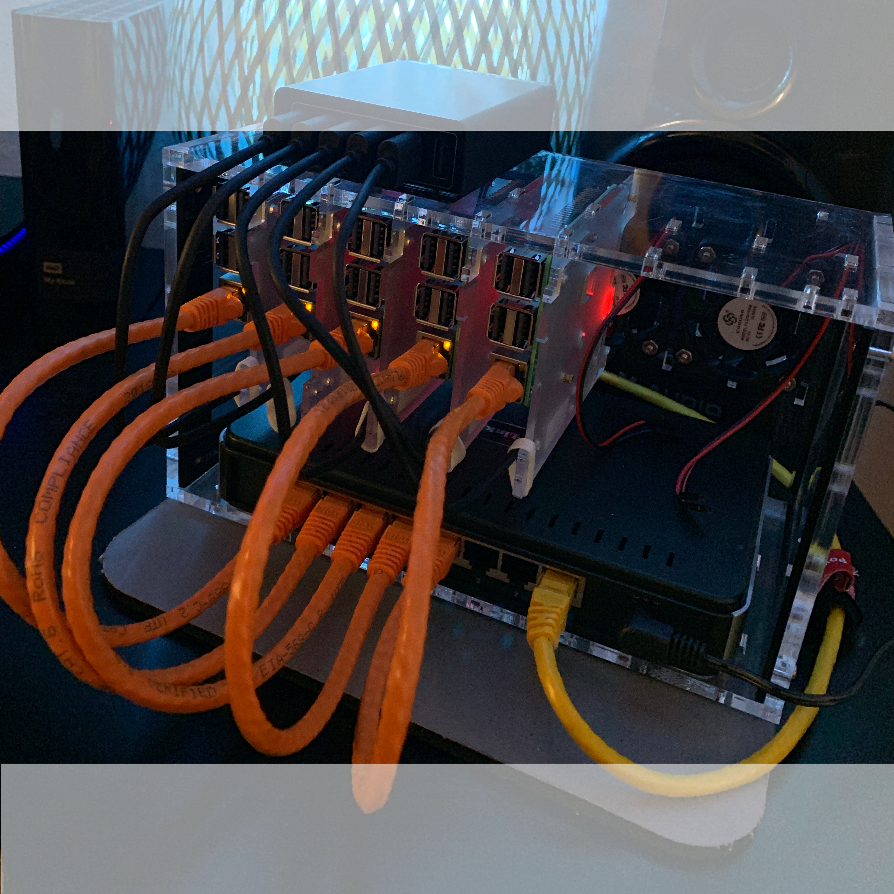
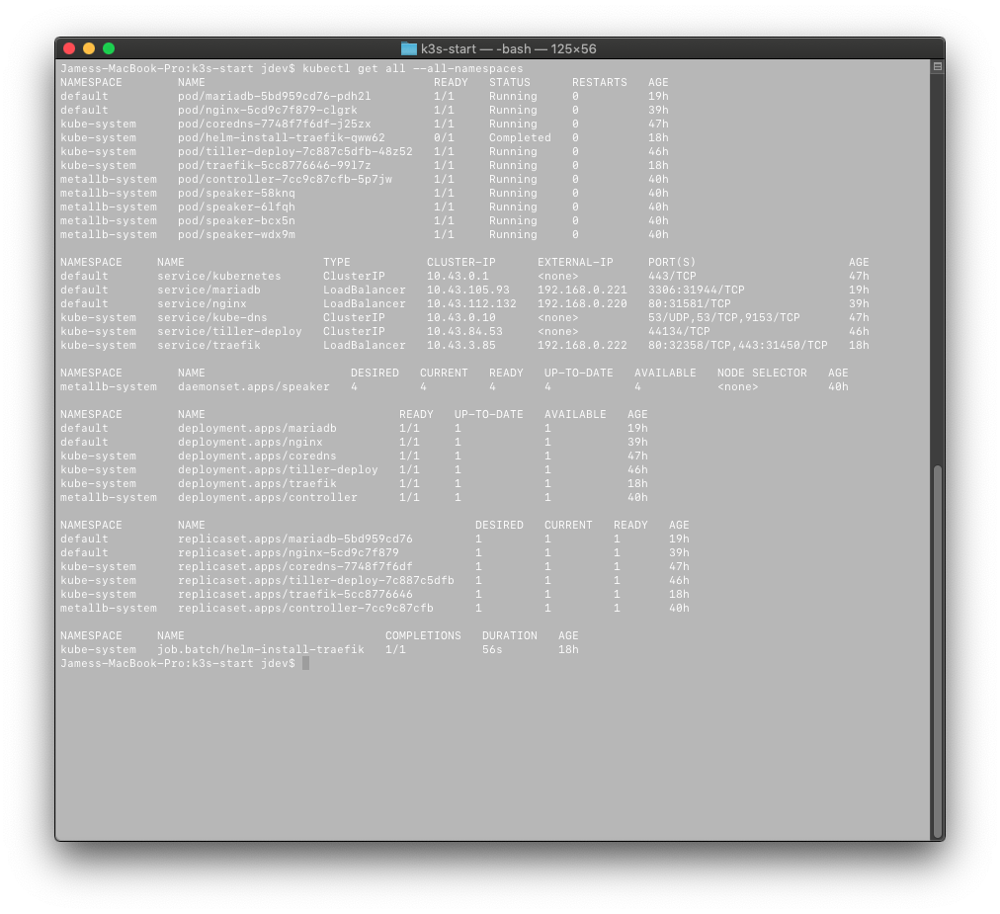

# k3s Raspberry Pi 3b+ Provisioning - Updated



## Cluster Specs
* 7 x Raspberry Pi 3b+
* 7 x 32 GB Samsung Class 10 Micro SD Cards
* 7 x 1 ft. microUSB right angled cords (for Power)
* 7 x 6" Flat CAT6 LAN patch cords
* Dlink 8 Port Eco-Friendly Router
* 2 x Anker 6 Port 60W USB hub
* C4Labs Cloudlet Case
* Development in MACOSX with bonjour (for *.local ip/hostnames)

## Prerequisits
1. Rasbperry Pi 3b+ (ARM32v7) Hardware similiar to my Cluster Specs
2. MAC/LINUX system to provision Cluster.
3. Static IP addresses for Raspberry Pi LANs
4. Working knowledge of LINUX OS.
5. Patience


## Flash Micro SD with Raspbian Stretch Lite
* https://medium.com/@mabrams_46032/kubernetes-on-raspberry-pi-c246c72f362f
1. Flash Raspbian Lite to MSD card. (MACOSX use Etcher)
2. Create wpa_supplicant.conf file (see example in boot folder)
3. Create ssh file (this is empty file, see example in boot folder)
4. Edit cmdline.txt file to disable auto size image and enable cgroups (see example in boot folder) - see boot/cmdline.txt in this repo for working example.

    A. Enable cpuset cgroup in /boot/cmdline.txt by adding:
    ```text
    cgroup_enable=cpuset cgroup_memory=1 cgroup_enable=memory
    ```

    B. Remove autoexpand system capability in /boot/cmdline.txt by deleting:
    ```text
    init=/usr/lib/raspi-config/init_resize.sh
    ```

    C. cmdline.txt should resemble the following:
    ```text
    dwc_otg.lpm_enable=0 console=serial0,115200 console=tty1 root=PARTUUID=7ee80803-02 rootfstype=ext4 elevator=deadline fsck.repair=yes rootwait quiet cgroup_enable=cpuset cgroup_memory=1 cgroup_enable=memory
    ```

5. Eject Micro SD card and start raspberry pi


## Login ssh pi@raspberrypi.local and update/upgrade on Master & Workers
1. Clear the current key (requried when flashing a new Raspberry pi)
```bash
ssh-keygen -R raspberrypi.local
```

2. SSH into Raspberry pi:
```bash
ssh pi@raspberrypi.local
```

3. Update the raspbian install
```bash
sudo apt update
sudo apt upgrade -y
```

4. Optional: Copy SSH RSA Key to Raspberry Pi
```bash
ssh-copy-id pi@k3s-xxx-xxx.local
```
Then, change the file `/etc/ssh/sshd_config` on the Pi, set `PasswordAuthentication` to `no`


## Remove linux swap file on Master & Workers
Turn off swap file
```bash
sudo dphys-swapfile swapoff && \
sudo dphys-swapfile uninstall && \
sudo update-rc.d dphys-swapfile remove
```
* https://medium.com/parkbee-tech/life-on-the-edge-a-first-look-at-ranchers-lightweight-kubernetes-distro-k3s-15a3aab1f0fb


## Install tmux on Master & Workers
```bash
sudo apt update
sudo apt install tmux -y
```


## Install the latest k3s on Master & Workers
```bash
wget https://github.com/rancher/k3s/releases/download/v0.4.0/k3s-armhf && \
chmod +x k3s-armhf && \
sudo mv k3s-armhf /usr/local/bin/k3s
```


## Install Docker on Master & Workers (Optional)
```bash
curl -fsSL https://get.docker.com | sh - && \
sudo usermod -aG docker pi
```


## Change the hostname, password and expand the disk image in the Advanced settings.
```bash
sudo raspi-config
```
Recommended: DO NOT RESTART WHEN EXITING raspi-config. Make an Image copy of the Micro SD at this stage. See below about stamping images.

Shutdown raspberrypi by typing:
```bash
sudo shutdown now
```
* https://desertbot.io/blog/headless-raspberry-pi-3-bplus-ssh-wifi-setup


## Stamping Images
There are many ways to create images for the master and worker nodes.  But, to learn by repetitition, and to keep things simple, I recommend setting up each node by hand.  To speed things up and not have to update/upgrade each time you can copy your Micro SD image after the previous step. The image created from the above process will be accessible by wifi, lan, and the image will be expanded to the full size of each card.  You simply need to log in and run ```sudo raspi-config``` to rename the hostname and restart the device.  The following headings will include which node the service must run on.  For now, k3s is only capable of running with a single master node.  For my cluster, the first Raspberry Pi is my masternode and the other four devices act as worker nodes.

I choose to give my raspberry pi's the following hostnames: ```k3s-master``` for the master, and ```k3s-worker-XX``` for each(XX) worker node.

## My Stamping Method
https://medium.com/@mabrams_46032/kubernetes-on-raspberry-pi-c246c72f362f

On linux
```bash
sudo fdisk -l /dev/sda
```
Same command on mac:
```bash
sudo fdisk /dev/disk2
```

Get block size on mac
```bash
diskutil info /dev/disk2 | grep “Device Block Size”
```

Dump data image from the memory card
```bash
sudo dd if=/dev/diskX of=k3s-base.img bs=512 count=END+1
```


## Changing the Host on your Pi by hand. Its easier to just use the raspi-config command above.
1. Modify the hosts file
  ```bash
  sudo nano /etc/hosts
  ```

2. Change the hostname
  ```bash
  sudo nano /etc/hostname
  ```

3. Commit the changes to the system
  ```bash
  sudo /etc/init.d/hostname.sh
  ```

4. Finally, reboot
  ```bash
  sudo reboot
  ```
* https://www.howtogeek.com/167195/how-to-change-your-raspberry-pi-or-other-linux-devices-hostname/


## Start k3s server on Master
The k3s server does not need to be ran with su priveledges.
```bash
k3s server --disable-agent --no-deploy=servicelb --no-deploy=traefik
```

## Start k3s agents on Worker Nodes
The k3s agent must be ran with su priveledges.
```bash
sudo k3s agent \
--server https://<__MASTER-IP__>:6443 \
--token <__NODE-TOKEN__>
```

### Start k3s agents on Workers with Docker support (Optional)
Remove ```--docker``` if wanting to use default containerd setup. Note: containerd will give an error that it cannot check the health of containers.  This error can be disregarded.
```bash
sudo k3s agent \
--docker \
--server https://<__MASTER-IP__>:6443 \
--token <__NODE-TOKEN__> \
> ~/logs.txt 2>&1 &
```


### Alternative Scripts to Install k3s agent and enable systemd
k3s Agent w/ Docker
```bash
curl -sfL https://get.k3s.io | K3S_URL=https://<master_ip>:6443 K3S_TOKEN=<token> INSTALL_K3S_EXEC="--docker" sudo sh -
```
Uninstall the above script:
```bash
/usr/local/bin/k3s-uninstall.sh
```
More Scripts can be found at the official Rancher k3s GitHub.
* https://github.com/rancher/k3s


## Running k3s in Docker - UPDATED check k3d project

### Start k3s agents on Docker
If you wish to run your k3s agents in docker containers.  Not recommended, but was experimented with.
```bash
docker run -d --tmpfs /run --tmpfs /var/run -e K3S_URL=${SERVER_URL} -e K3S_TOKEN=${NODE_TOKEN} --privileged rancher/k3s:v0.3.0
```


## Kubeconfig location on Master:

### Location when started at user level:
```bash
cat /home/pi/.kube/k3s.yaml
```
Get this file using sftp using a new terminal window
```bash
sftp pi@k3s-master.local
>> get /home/pi/.kube/k3s.yaml .
>> lpwd # shows where k3s.yaml was downloaded to your local machine
```


### Location when started with sudo:
```bash
cat /etc/rancher/k3s/k3s.yaml
```
Get this file using sftp using a new terminal window
```bash
sftp pi@k3s-master.local
>> get /etc/rancher/k3s/k3s.yaml .
>> lpwd # shows where k3s.yaml was downloaded to your local machine
```


## Access your k3s cluster with kubectl
Two options:
1. Local (on Raspberry Pi Master) ```ssh pi@k3s-master.local``` gives access to```sudo k3s kubectl ...``` 
2. Remote (another computer attached to the local network) ```export KUBECONFIG="file_path/k3s.yaml"``` and access your cluster using ```kubectl ...``` 

Note: all commands will be given as ```kubectl``` beyond this point.  If you are connected to pi@k3s-master.local use ```sudo k3s kubectl```.


## Label the cluster nodes
1. Label master and taint the node to not schedule work for itself

    A. Label masternode 
    ```bash
    kubectl label node k3s-master kubernetes.io/role=master
    ```

    B. Apply master role
    ```bash
    kubectl label node k3s-master node-role.kubernetes.io/master=""
    ```

    C. Taint master node
    ```bash
    kubectl taint nodes k3s-master node-role.kubernetes.io/master=effect:NoSchedule
    ```

2. Label Worker node roles - must be done for each worker node

    A. Label worker node as role node
    ```bash
    kubectl label node k3s-worker-xx kubernetes.io/role=node
    ```
    B. Apply Node role to node
    ```bash
    kubectl label node k3s-worker-xx node-role.kubernetes.io/node=""
    ```


## Install helm for armhf using Jesse Stuart code
1. Create tiller system account
```bash
kubectl -n kube-system create sa tiller \
 && kubectl create clusterrolebinding tiller \
      --clusterrole cluster-admin \
      --serviceaccount=kube-system:tiller
```

2. More Role Binding
```bash
kubectl patch deploy --namespace kube-system tiller-deploy -p '{"spec":{"template":{"spec":{"serviceAccount":"tiller"}}}}'  
```
* https://stackoverflow.com/questions/46672523/helm-list-cannot-list-configmaps-in-the-namespace-kube-system

3. Install tiller on k3s for armhf
```bash
helm init --tiller-image=jessestuart/tiller --service-account tiller
```
* https://github.com/jessestuart/tiller-multiarch


## Apply Layer 2 Metallb
https://metallb.universe.tf/tutorial/layer2/

1. Apply the MetalLB service
```bash
kubectl apply -f https://raw.githubusercontent.com/google/metallb/v0.7.3/manifests/metallb.yaml
```

2. Apply your metallb-config.yaml
```YAML
apiVersion: v1
kind: ConfigMap
metadata:
  namespace: metallb-system
  name: config
data:
  config: |
    address-pools:
    - name: default
      protocol: layer2
      addresses:
      - 192.168.0.220-192.168.0.245
```


## Apply MariaDB
Modified deployment from https://hub.docker.com/r/linuxserver/mariadb to mariadb-deployment.yaml to utilize MetalLB and expose a LoadBalanced IP.  More could be done to deploy a replica-set.

```bash
kubectl apply -f ./mariadb-deployment.yaml
```


## Install OpenFaas
Create secret for openfaas
```bash
kubectl -n openfaas create secret generic basic-auth \
--from-literal=basic-auth-user=admin \
--from-literal=basic-auth-password=abc1
```

Create namespaces for Openfaas and Openfaas functions
```bash
kubectl apply -f https://raw.githubusercontent.com/openfaas/faas-netes/master/namespaces.yml
```

OR create your own namespaces using the YAML below:
```YAML
apiVersion: v1
kind: Namespace
metadata:
  name: openfaas
  labels:
    role: openfaas-system
    access: openfaas-system
    istio-injection: enabled
---
apiVersion: v1
kind: Namespace
metadata:
  name: openfaas-fn
  labels:
    istio-injection: enabled
    role: openfaas-fn
```

Apply the Helm chart from this repo
```bash
helm repo update \
 && helm upgrade openfaas --install ./faas-netes/chart/openfaas \
    --namespace openfaas  \
    --set basic_auth=false \
    --set functionNamespace=openfaas-fn \
    --set serviceType=LoadBalancer
```
* https://github.com/openfaas/faas-netes/tree/master/chart/openfaas

In case you mess up and need to fully remove the openfaas helm chart:
```bash
helm del --purge openfaas   
```

Addition Resource: https://www.hanselman.com/blog/HowToBuildAKubernetesClusterWithARMRaspberryPiThenRunNETCoreOnOpenFaas.aspx


## Connecting to OpenFaaS cluster using faas-cli

Check if you can access your OpenFaaS from your local terminal
```bash
faas-cli list -g <LOADBALANCER_EXT_IP>:8080 
```


## Apply Grafana to monitor openFaaS - IN PROGRESS

```bash
helm repo update \
 && helm upgrade grafana --install ./grafana \
    --namespace openfaas  \
    --set basic_auth=false
```
Get the ```admin``` account password
```bash
kubectl get secret --namespace openfaas grafana -o jsonpath="{.data.admin-password}" | base64 --decode ; echo
```

Still working on display panels for OpenFaaS prometheus metrics.


## Ethernet-to-Ethernet (Wired-to-Wired) Network Bridge
Using usb2.0 gigabit lan adapter
* Tutorial: https://drjohnstechtalk.com/blog/2014/03/bridging-with-the-raspberry-pi/
* Docs: https://wiki.linuxfoundation.org/networking/bridge
```bash
sudo apt install bridge-utils
```

Check USB devices
```bash
lsusb
```

Create Bridge and add eth0 and eth1
```bash
sudo brctl addbr br0
sudo brctl addif br0 eth0
sudo brctl addif br0 eth1
```

Define br0 in ```/etc/network/interface```
```text
auto br0
iface br0 inet dhcp
bridge_ports eth0 eth1
```
* https://raspberrypi.stackexchange.com/questions/47010/losing-access-to-raspberry-pi-after-bridge-br0-comes-up


## Provision Docker Repository for OpenFaaS Images - BROKEN
Not working having problems with certs

```bash
helm repo update \
 && helm upgrade docker-registry --install ./docker-registry \
    --namespace docker-registry \
    --set basic_auth=false
```


## Kubernetes Dashboard - BROKEN

Modified the below YAML to k8s-dashboard-head.yaml
```bash
kubectl apply -f https://raw.githubusercontent.com/kubernetes/dashboard/master/aio/deploy/recommended/kubernetes-dashboard-head.yaml
```
ERROR: The UI will load to the certificate stage then not allow you to actually log in.

## Rancher server HA on gateway cluster
1. Install cert manager
    a. Following code does not work for ARM32v7 need a different cert mananager.
      ```bash
      helm install stable/cert-manager \
      --name cert-manager \
      --namespace kube-system \
      --version v0.5.2
      ```


## Rancher-agent - BROKEN
Raspberry pi (ARM32V7) not supported????
```bash
sudo docker run -d --restart=unless-stopped -p 80:80 -p 443:443 -v /opt/rancher:/var/lib/rancher rancher/rancher:latest
```

## Build rancher/rancher for armhf
* https://gist.github.com/ags131/7bdde11c932ef7a54f44c6decbfd88b8

Build code on Raspberrypi/OdroidXU4

1.  Install Dapper
```bash
sudo curl -sL https://releases.rancher.com/dapper/latest/dapper-`uname -s`-`uname -m` -o /usr/local/bin/dapper;
sudo chmod +x /usr/local/bin/dapper
```

2. Download rancher and build with dapper
```bash
git clone https://github.com/rancher/rancher
cd rancher
git checkout v2.1.9
export ARCH=arm64
export DAPPER_HOST_ARCH=arm
dapper
```

## Build Longhorn for storage
minio requirement - https://github.com/dvstate/minio/blob/master/Dockerfile.release.armhf

## Citations and Further Info
Sources are noted as bulleted hyperlinks proceding the cited information.  In the case of any questions, comments, or missing citations please contact the owner of this repository directly.  Do not hesitate to submit a Pull and add-on to this tutorial to better the Open Source Raspberry Pi Cluster Community.

## Ansible Provisioning for Raspberry Pi Infrastructure
See https://github.com/boyroywax/ansible-k3s-rpi


# Understanding RBAC


# Persistent Storage

## Helm nfs-client-provisioner k8s deployment


## Helm nfs-client-provisioner - BROKEN

Error: having problems getting NFS server to mount - [Logs](logs/helm-nfs-client-provisioner-mount-error)

```bash
helm repo update && \
helm install --name nfs-client-provisioner-arm \
--namespace nfs-client-provisioner \
--set nfs.server=odroid-01.local \
--set nfs.path=/media/ssd/nfs \
./helm-nfs-client-provisioner-arm
```
Attempted solutions:
- Install nfs-common on all the k3s nodes
- Check permissions
- set mount options: ```_netdev, auto, souid, nouid, vers=4.1```
- disable RBAC
- disable Security

